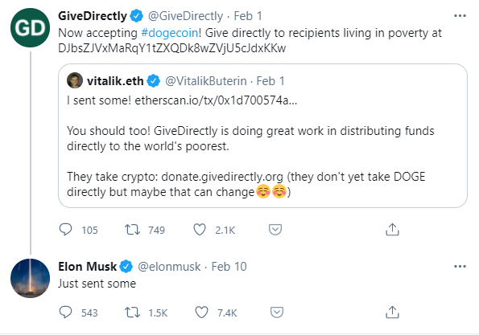

# The TweeElon Charity

The TweeElon Charity is an open-source project to create a [decentralized application](https://en.wikipedia.org/wiki/Decentralized_application) that automatically donates bitcoins to charity every time Elon Musk mentions `#Bitcoin` on Twitter. Additionally, each donation's transaction will store Elon Musk's tweet as a message on the Bitcoin blockchain forever.

The goal of the project is to crowdfund donations for charity, incentivize Elon Musk to talk about Bitcoin as a tech influencer, demonstrate the programmability of Bitcoin, and inspire similar projects in the future.

The bitcoins will be donated to [GiveDirectly](https://www.givedirectly.org/), a nonprofit organization operating in East Africa that helps families living in extreme poverty by making unconditional cash transfers to them via mobile phone. Elon Musk and Vitalik Buterin have [already donated](https://twitter.com/elonmusk/status/1359591256003854336) cryptocurrencies to GiveDirectly in the past.



The project is still in development. Here is a quick description of each file:
* [twitterAPI.py](twitterAPI.py): detects if Elon Musk's last tweet contains `#Bitcoin` in it using the [Twitter API](https://developer.twitter.com/en/docs/twitter-api/getting-started/guide). 
* [bitcoinAPI.py](bitcoinAPI.py): triggers a bitcoin transaction using the [Bit library](https://ofek.dev/bit/) and stores a message on the blockchain
* [main.py](main.py): connects [twitterAPI.py](twitterAPI.py) and [bitcoinAPI.py](bitcoinAPI.py) in one command. Run `python main.py` to run the project's code.
* [config.py](config.py): configures the project parameters like the Twitter API credentials, Bitcoin wallets/addresses, etc.

## Requirements

To run the project, you'll need to access the Twitter API by creating a Twitter developer account, creating a Twitter app, and generating a set of credentials that you will use to authenticate all requests to the Twitter API. Instructions can be found [here](https://developer.twitter.com/en/docs/twitter-api/getting-started/guide). 

The [Bit library](https://ofek.dev/bit/) in Python is also required to execute Bitcoin transactions. You can install it using: ```pip install bit```

## Next Steps

* Automate the script execution to trigger when Elon Musk posts a new tweet
* Decentralize the app so that no one controls the bitcoins in the sending wallet


